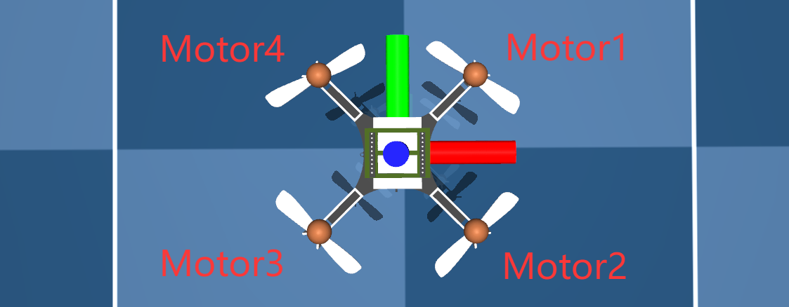

## ACADOS NMPC Quadrotor Position Control Demo

## 物理模型

```python
    g0  = 9.8066     # [m.s^2] accerelation of gravity
    mq  = 33e-3      # [kg] total mass (with one marker)
    Ixx = 1.395e-5   # [kg.m^2] Inertia moment around x-axis
    Iyy = 1.395e-5   # [kg.m^2] Inertia moment around y-axis
    Izz = 2.173e-5   # [kg.m^2] Inertia moment around z-axis
    Cd  = 7.9379e-06 # [N/krpm^2] Drag coef
    Ct  = 3.25e-4    # [N/krpm^2] Thrust coef
    dq  = 65e-3      # [m] distance between motors' center
    l   = dq/2       # [m] distance between motors' center and the axis of rotation

```

电机转速范围：0-22krpm

Cd表示螺旋桨旋转所带来的反扭

Ct表示螺旋桨旋转所带来的拉力

单个电机最大拉力：

$$
F_{max}=C_t\cdot\omega_{max}^2=3.25\times10^{-4}\times22^2=0.1573N
$$

单个电机最大反扭：

$$
M_{max}=C_d\cdot\omega_{max}^2=7.9379\times10^{-6}\times22^2=3.842\times10^{-3}N\cdot m
$$

在mujoco中Actuator使用归一化输入，所有电机控制输入范围为0-1：

```xml
  <actuator>
    <motor class="cf2" ctrlrange="0 1" gear="0 0 0.1573 0 0 -3.842e-03" site="motor1_site" name="motor1"/>
    <motor class="cf2" ctrlrange="0 1" gear="0 0 0.1573 0 0 3.842e-03" site="motor2_site" name="motor2"/>
    <motor class="cf2" ctrlrange="0 1" gear="0 0 0.1573 0 0 -3.842e-03" site="motor3_site" name="motor3"/>
    <motor class="cf2" ctrlrange="0 1" gear="0 0 0.1573 0 0 3.842e-03" site="motor4_site" name="motor4"/>
  </actuator>
```

其中site为电机在机体坐标系中的坐标

电机旋转方向以及编号： 红色 绿色 蓝色 分别为机体坐标系 x y z轴




其中Motor4和Motor2顺时针旋转，Motor1和Motor3逆时针旋转。

## 动力学

根据四元数计算从机体坐标系转换到世界坐标系的旋转矩阵：

$$
R_b^w=
\begin{bmatrix}
1-2q_2^2-2q_3^2  & 2(q_1\cdot q_2-q_0\cdot q_3) & 2(q_1\cdot q_3 + q_0\cdot q_2) \\ 
2(q_1\cdot q_2 + q_0\cdot q_3)  & 1-2q_1^2-2q_3^2 & 2(q_2\cdot q_3 - q_0\cdot q_1)\\
2(q_1\cdot q_3 - q_0\cdot q_2)  & 2(q_2\cdot q_3 + q_0\cdot q_1) & 1-2q_1^2-2q_2^2
\end{bmatrix}
$$

### 四元数求导

小角度变化情况下，四元数微小变化量可如下表示：

$$
\Delta q=
\begin{bmatrix}
1 \\ \frac{\Delta \theta}{2} 
\end{bmatrix}
$$

$$
\Delta \theta = \boldsymbol \omega\cdot dt
$$

此角度变化量可直接由陀螺仪测量计算，为机体坐标系中的角度变化量。

更新四元数：

$$
q\otimes \Delta q= \frac{1}{2}
\begin{bmatrix}
0  & -\Delta \theta_x & -\Delta \theta_y & -\Delta \theta_z\\
\Delta \theta_x  & 0 & \Delta \theta_z & -\Delta \theta_y\\ 
\Delta \theta_y  & -\Delta \theta_z & 0 & \Delta \theta_x\\
\Delta \theta_z  & \Delta \theta_y & -\Delta \theta_x & 0
\end{bmatrix}
$$

四元数近似求导：

$$
q{}' = \frac{1}{2} 
\begin{bmatrix}
 0 & -\omega_x & -\omega_y & -\omega_z\\
\omega_x  & 0 & \omega_z & -\omega_y\\
\omega_y  & -\omega_z & 0 & \omega_x\\
\omega_z  & \omega_y & -\omega_x & 0
\end{bmatrix}
$$

程序实现：

```python
    dq0 = -(q1*wx)/2 - (q2*wy)/2 - (q3*wz)/2
    dq1 =  (q0*wx)/2 - (q3*wy)/2 + (q2*wz)/2
    dq2 =  (q3*wx)/2 + (q0*wy)/2 - (q1*wz)/2
    dq3 =  (q1*wy)/2 - (q2*wx)/2 + (q0*wz)/2
```

### 角速度求导

刚体动力学――欧拉方程： M为刚体三轴扭矩输入

$$
\mathrm {M}=\mathrm{I}\dot{\boldsymbol \omega} +\boldsymbol \omega\times(\mathrm{I}\boldsymbol \omega)
$$

从而得到角速度微分也就是角加速度的公式：

程序实现：

```python
dwx = (mx + Iyy*wy*wz - Izz*wy*wz)/Ixx
dwy = (my - Ixx*wx*wz + Izz*wx*wz)/Iyy
dwz = (mz + Ixx*wx*wy - Iyy*wx*wy)/Izz
```

其中扭矩表达式：

```python
mx = Ct*l*(  w1**2 - w2**2 - w3**2 + w4**2)
my = Ct*l*( -w1**2 - w2**2 + w3**2 + w4**2)
mz = Cd*  ( -w1**2 + w2**2 - w3**2 + w4**2)
```

1.Motor1 Motor4使得机体绕自身X轴正向旋转 Motor2 Motor3使得使得机体绕自身X轴逆向旋转

2.Motor1 Motor2使得机体绕自身Y轴逆向旋转 Motor3 Motor4使得使得机体绕自身Y轴正向旋转

3.Motor1 Motor3产生顺时针反扭 Motor2 Motor4产生逆时针反扭(逆时针为正)

### 位置求导

就是速度

### 速度求导

四旋翼四个电机的总体推力方向沿机体坐标系Z轴，将推力转换到世界坐标系，再加上重力即可

## NMPC

使用13维度状态向量：

```python
x = vertcat(px, py, pz, q0, q1, q2, q3, vx, vy, vz, wx, wy, wz)
```

px, py, pz: 世界坐标系位置

q0, q1, q2, q3:四元数

vx, vy, vz:世界坐标系速度

wx, wy, wz: 机体坐标系角速度

使用4维度输入向量，也就是四个电机的转速输入，单位krpm:

```python
u = vertcat(w1, w2, w3, w4)
```
